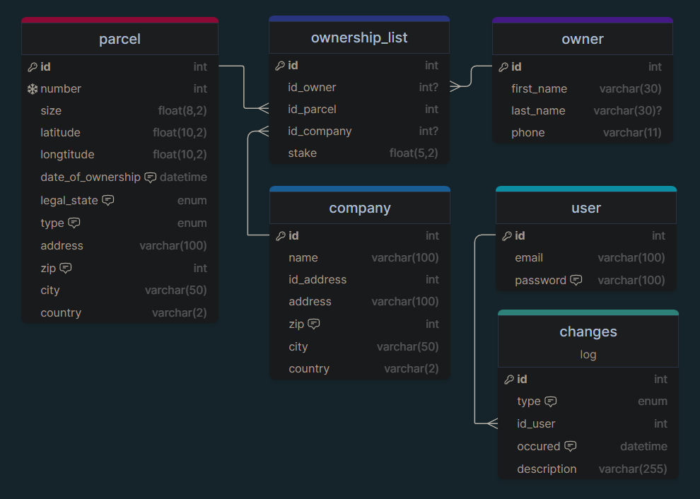

#  Alpha 3

## Description

This is the third alpha project for my school.
It is a website that allows the user to delete, view and upload data onto a premade database based on Cadastre of Real
Estate.
The processing is done by a backend written
in .
The website is written
in ,

and .
 
This project was made by [Matyáš Závora](https://www.linkedin.com/in/matyas-zavora/) (me)
 

#### Grade(s):

|           Percent score            |   53%    |
|:----------------------------------:|:--------:|
|            Czech grade             |  __3__   |
|  Configurability and universality  | __83%__  |
|  Architecture and design patterns  | __34%__  |
|   Usability and program control    | __90%__  |
|     Correctness and efficiency     | __48%__  |
|     Testing and error handling     | __46%__  |
| Documentation and code readability | __43%__ |

### Prerequisites

- [<u></u>](https://www.apachefriends.org/index.html) (
  or any other web server)
- A [<u></u>](https://www.mysql.com) database
    - Note: It is already present in [<u></u>](https://www.apachefriends.org/index.html)
- [<u></u>](https://www.php.net/downloads.php)
  7.4 (or higher)
- A web browser
- (Optional) Access to the internet (
  for )
    - Note: website is fully functional
      without ,
      but it won't look as good as it is supposed to.

## Installation

#### Windows

1. Open  or any other web server
2. Clone this repository into the `htdocs` folder of 
3. Start  (Apache should be enough) (default port is 80)
4. Open `localhost[:port]/alpha3` in your browser
5. Import the database from `alpha3/database.sql` into your MySQL database
    1. Open `localhost[:port]/phpmyadmin`
    2. Click on `New` in the left sidebar
    3. Name the database `alpha3`
    4. Click on the `alpha3` database in the left sidebar
    5. Click on `Import` in the top bar
    6. Click on `Choose file` and select `alpha3/alpha3.sql`
    7. Click on `Go`
6. Configure the `config.php` file in the `alpha3` folder
    1. Open `alpha3/config.php` in a text editor
    2. Change the `db_server`, `db_user`, `db_pass`, `db_name` and `dp_port` to match your MySQL database

## Database diagram

